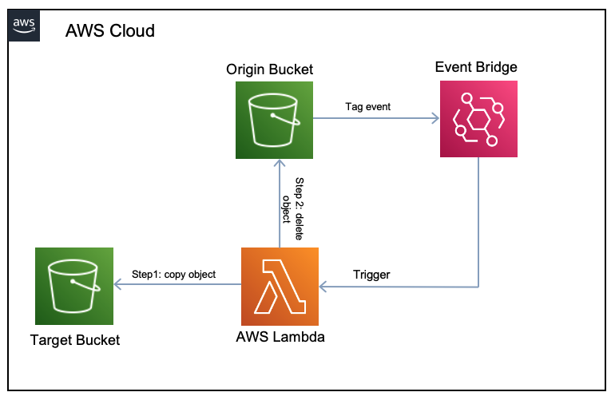
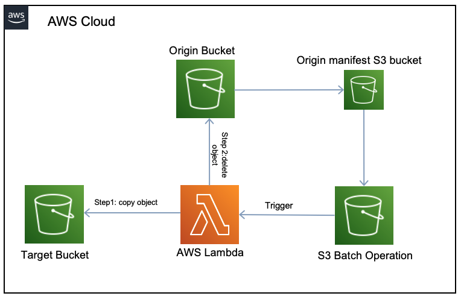

# Move AWS S3 Tagged object

These Lambda functions will move tagged objects from one bucket to another. So if one day you need to automatically detected when an object gets tagged and perform a move operation (copy and then delete) these lambda might do the trick.

## Requirements
- python >= 3.7
- boto3 >= 1.20.24
- Writing permissions in the target bucket
- Read permissions in the origin bucket

## A bit of history and explanation

I was given a mission (jira ticket) to figure a way to safely remove tagged objects for example with the tag `LifeCycle=Delete` from a very critical s3 bucket. Our goal is to move the desired objects to a secondary bucket which will then be wiped later after a certain amount of days as a safeguard in case we need to restore the objects back. This doesn't sound to complicated right? well the thing is that this bucket currently has millions of critical objects and there isn't lifecycle rule that can do the trick. 

I came up with two lambda functions to solve this in two different scenarios.

### [Scenario 1] Triggered by EventBridge

In this scenario the origin bucket (the bucket with the million of objects) will generate notifications everytime an objects gets tagged, [AWS EventBridge](https://aws.amazon.com/eventbridge/) service will listen these events and will trigger the `lambda/triggered_by_event.py` function which then will look for the specified tag and if the objects has it will copy the object to a target bucket (a temporary bucket) to be removed later on with a lifecycle rule.

### [Scenario 2] Triggered by S3 Batch Operation

But what happens with the existing tagged objects? Well at first I was trying to just do a list objects operation but then I rapidly figured that this is a linear time complexity operation and for a million objects will take days or months.

In this case, the idea is to generate and [inventory configuration](https://docs.aws.amazon.com/AmazonS3/latest/userguide/storage-inventory.html) of all the objects in the buskets that will serve as input of an [S3 Batch Operation](https://docs.aws.amazon.com/AmazonS3/latest/userguide/batch-ops.html). This Batch job will execute `lambda/triggered_by_s3batch.py` function on every object in the inventory previously generated to determine if the tag exist and if it does will proceed to move the object like in the previous scenario.

Hope you find this project useful.
