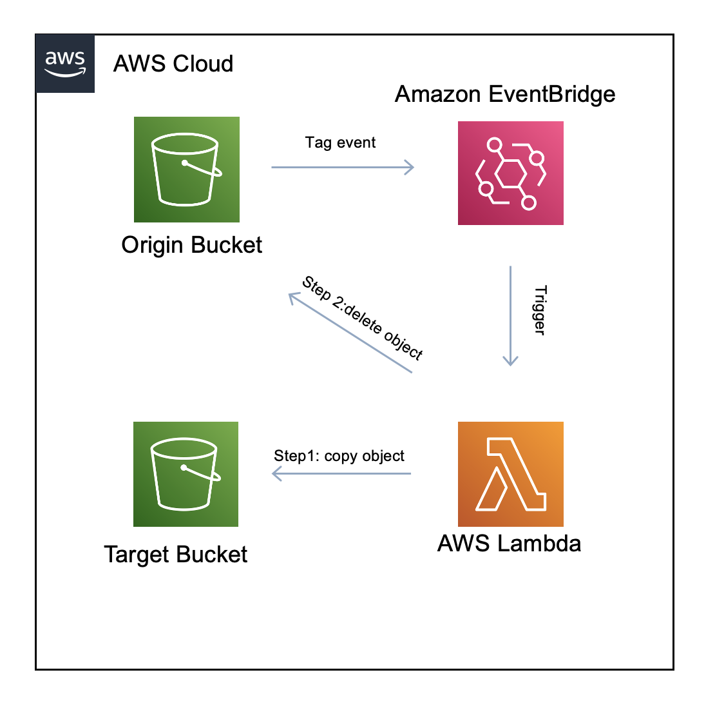

# Move AWS S3 Tagged object with Eventbridge and Lambda

This Lambda functions will move tagged objects from one bucket to another. The reason behind this is that there isn't a lifecycle rule that can automate this. So in the case you need to automatically detected when an object gets tagged and perform a move operation (copy and then delete) this peace of code will do the trick.

## Requirements
- python >= 3.7
- boto3 >= 1.20.24
- Writing permissions in the target bucket
- Read permissions in the origin bucket

## How this works

An event is generated by the origin bucket everytime an objects gets tagged, this event is collected by AWS EventBridge service which then triggers the Lambda function. The code will look for the bucket and object name, then will get object tags and compare with the ones in TAGS constant (this I need to do better), if the tags matches will copy the object to the target s3 bucket and will delete it from the origin bucket
